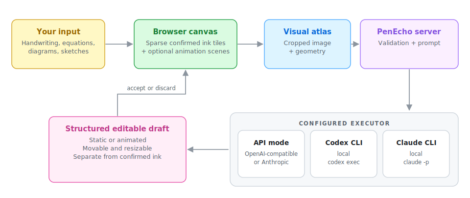

<h1 align="center">
  
</h1>

<p align="center">
  <a href="README.md">English</a> |
  <a href="README.zh-CN.md">简体中文</a> |
  <a href="README.ja.md">日本語</a> |
  <a href="README.ko.md">한국어</a> |
  <a href="README.ru.md">Русский</a> |
  <strong>Español</strong> |
  <a href="README.pt-BR.md">Português (Brasil)</a> |
  <a href="README.fr.md">Français</a> |
  <a href="README.de.md">Deutsch</a>
</p>

<p align="center"><strong>Piensa con IA más allá del chat.</strong></p>

<p align="center">PenEcho es un lienzo compartido donde la escritura a mano, las ecuaciones, los diagramas y el contexto espacial forman parte de la conversación.</p>

<p align="center">
  <a href="https://discord.gg/3jrPJ3mXdX"></a>
  <a href="https://github.com/penecho/penecho/stargazers"></a>
  <a href="LICENSE"></a>
</p>

> Esta traducción ofrece una visión general del proyecto. El [README en inglés](README.md) es la fuente canónica para la información técnica más reciente y completa.

<p align="center"></p>

<p align="center"></p>

## Kimi Open Source Friends

PenEcho es miembro oficial de **Kimi Open Source Friends**, el programa de [Moonshot AI](https://www.kimi.com/) que apoya proyectos destacados de código abierto. El equipo de Kimi contribuye con créditos de API, y Kimi K3 es uno de los modelos recomendados para trabajo exigente con escritura y diagramas.

- [Kimi Code](https://www.kimi.com/code?aff=penecho) - suscripción de programación disponible en todo el mundo
- [Kimi Open Platform, China](https://platform.kimi.com?aff=penecho) - acceso a la API desde China continental
- [Kimi Open Platform, global](https://platform.kimi.ai?aff=penecho) - acceso a la API desde el resto del mundo

## Inicio rápido

Necesitas [Node.js 18.17 o posterior](https://nodejs.org/) y una de estas opciones: una clave de API, un [Codex CLI](https://developers.openai.com/codex/cli) autenticado o un [Claude Code CLI](https://code.claude.com/docs/en/overview) autenticado.

```bash
npm install -g penecho
penecho configure
penecho
```

Abre [http://localhost:3888](http://localhost:3888). `penecho configure` permite seleccionar de forma interactiva la fuente LLM, el modelo, el nivel de razonamiento, el tiempo de espera, el formato de imagen y la interfaz de red. La configuración se guarda por defecto en `~/.penecho/config.env`; las credenciales de API nunca se envían al navegador.

Para ejecutar el código fuente:

```bash
git clone https://github.com/penecho/penecho.git
cd penecho
npm install
npm start
```

## Piensa sobre el lienzo

Escribe una pregunta, ecuación, diagrama o idea incompleta en cualquier lugar del lienzo y haz una pausa. PenEcho interpreta los trazos y sus relaciones espaciales y coloca la respuesta junto a ellos.

- Dibuja con lápiz o ratón y desplázate por un lienzo de `20 000 x 20 000`.
- Obtén respuestas, pistas, explicaciones, fórmulas, gráficas y diagramas directamente sobre el lienzo.
- Mueve y redimensiona borradores de IA; acéptalos o descártalos antes de incorporarlos al trabajo.
- Selecciona tinta con el lazo para moverla, escalarla, cambiar su color, eliminarla o pasarla por Typeset.
- Guarda instantáneas localmente en el navegador y exporta el contenido confirmado como PNG.
- Elige entre los temas Arcane, Sci-fi, Research y Studio.

## Novedades de la versión 0.7.0

- **HTML interactivo en el lienzo.** El plugin General HTML permite crear relojes, calculadoras, paneles y otras interfaces como widgets interactivos aislados.
- **Datos útiles sin un servicio de PenEcho.** Los plugins de clima, bolsa, noticias tecnológicas, divisas, terremotos, eventos naturales, clima espacial y GitHub consultan las API declaradas directamente desde el navegador.
- **Límites de seguridad explícitos.** La red de cada plugin se restringe a una lista permitida, el HTML se ejecuta en un iframe aislado y los plugins desactivados no participan en las solicitudes ni en la ejecución.
- **Creación local de plugins.** Un formato Markdown compacto permite mejorar borradores con IA, completar títulos, guardar, activar y eliminar plugins personales desde una interfaz preliminar.
- **Persistencia y exportación propias del lienzo.** Los widgets confirmados se incluyen en instantáneas y PNG; admiten movimiento, redistribución, escalado y eliminación reversible.
- **Valores predeterminados razonables.** General HTML, Animation scenes y Weather se activan para usuarios nuevos; los demás plugins de datos requieren activación explícita.

## Versiones anteriores

- **0.6.0 - Animation scenes.** Incorporó animaciones Canvas2D declarativas y seguras con edición y persistencia en instantáneas, mejor renderizado de Markdown/LaTeX, respuestas de modelos más robustas y comprobaciones de actualización de npm sin bloqueo.

## Cómo funciona

<p align="center"><picture><source media="(prefers-color-scheme: dark)" srcset="docs/assets/how-it-works-dark.svg"></picture></p>

El navegador solo envía el recorte pertinente del lienzo y su geometría. El servidor valida la solicitud, la dirige al ejecutor elegido y devuelve un borrador estructurado y móvil. Las recomendaciones actuales de modelos y los ejemplos de costes están en el [README en inglés](README.md#recommended-model-configurations).

## Despliegue seguro

- **Codex CLI y Claude CLI:** úsalos solo en el equipo local o en una red de confianza. Cada solicitud válida inicia un proceso CLI local, por lo que estos modos no deben exponerse directamente a Internet.
- **Modo API:** si lo publicas, sitúa PenEcho detrás de un proxy HTTPS con autenticación y límites de frecuencia y tamaño de solicitud.
- No publiques archivos de configuración, claves de API, trazas de solicitudes, registros ni imágenes privadas del lienzo.

## Colabora con el proyecto

Antes de enviar un cambio, ejecuta:

```bash
npm run check
```

Consulta las [notas de arquitectura](docs/architecture.md) y [CONTRIBUTING.md](CONTRIBUTING.md). Comparte preguntas y ejemplos en [Discord](https://discord.gg/3jrPJ3mXdX) o [GitHub Discussions](https://github.com/penecho/penecho/discussions), y comunica errores reproducibles en [GitHub Issues](https://github.com/penecho/penecho/issues).

## Licencia y uso comercial

PenEcho se publica bajo [GNU AGPL v3.0 only](LICENSE). Se permite el uso comercial, pero si ofreces una versión modificada a usuarios a través de una red, debes proporcionarles el código fuente correspondiente según la AGPL. Existe una [licencia comercial](COMMERCIAL-LICENSE.md) para productos propietarios y servicios alojados que no puedan cumplir la AGPL. El nombre y el logotipo están sujetos a la [política de marcas](TRADEMARKS.md).
