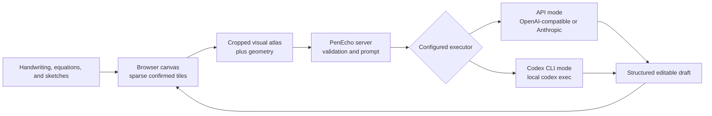

<h1 align="center">
  
</h1>

<p align="center"><strong>Think with AI beyond the chat box.</strong></p>

<p align="center">PenEcho is a shared canvas where handwriting, equations, diagrams, and spatial context become part of the conversation.</p>

<p align="center">
  
</p>

## Think on the canvas

Put a question, equation, diagram, or half-formed idea anywhere on the canvas and pause. PenEcho reads your marks and their spatial relationships, then answers beside them. You can work through a problem without translating every step into a chat message or rebuilding it with rigid diagram tools.

- Get answers, hints, explanations, continuations, formulas, plots, and diagrams directly on the canvas.
- Move, resize, accept, or discard every AI draft before it becomes part of your work.
- Draw naturally with a stylus or mouse, then pan and zoom across a sparse `20,000 x 20,000` canvas.
- Choose Arcane, Sci-fi, or Research mode to match the kind of problem you are exploring.
- Save lightweight snapshots locally in your browser. Starting a new canvas can overwrite the current snapshot, save a new copy, or continue without saving; unconfirmed AI drafts are never included.

PenEcho has no npm runtime dependencies. It only allocates `512 x 512` tiles where ink exists, so the huge logical canvas does not become a huge bitmap.

## How it works



The browser sends only the relevant canvas crop and geometry. The server validates the request, uses the selected executor, and returns a movable draft that stays separate from confirmed ink until you accept it.

## Quick start

You need [Node.js 18+](https://nodejs.org/) and either an API key or an installed [Codex CLI](https://developers.openai.com/codex/cli).

```bash
npm install -g penecho
```

### Option 1: API

```bash
penecho doctor --api
penecho --api
```

The doctor guides you through the API URL, model, and hidden API-key prompt. It stores the configuration locally in `~/.penecho/config.env`; the key is plaintext, receives owner-only permissions on POSIX systems, and is never sent to browser code. Protect this file like any other local credential. API mode supports OpenAI-compatible Chat Completions and Anthropic Messages endpoints.

### Option 2: Codex on your machine

```bash
codex login
penecho doctor --codex
penecho --codex
```

This runs `codex exec` locally for each canvas request. It uses your authenticated Codex CLI directly and does not require an API key. Startup checks the CLI version and login state without calling a model or consuming tokens. It is a local execution path through Codex, not a local model.

Choose another port when needed:

```bash
penecho --codex --port 4000
```

When running from source, copy the appropriate example to `.env` and use `npm start` as before.

Open [http://localhost:3888](http://localhost:3888). Other devices on the same trusted LAN can use `http://<this-computer-LAN-IP>:3888`.

## Token use and cost

The following is an illustrative estimate, not an enforced PenEcho token budget. Assuming a request uses `10,000` input tokens and `1,000` output tokens, the standard short-context API cost would be:

- `gpt-5.6-sol`: `10,000 x $5.00 / 1M + 1,000 x $30.00 / 1M = $0.080`
- `gpt-5.6-terra`: `10,000 x $2.50 / 1M + 1,000 x $15.00 / 1M = $0.040`
- `gpt-5.6-luna`: `10,000 x $1.00 / 1M + 1,000 x $6.00 / 1M = $0.016`

At those example quantities, that is about 1.6 to 8 cents per request. Actual input, reasoning, and output usage varies by canvas content, model, provider, and retry behavior. Prices can change, so check the [OpenAI API pricing](https://developers.openai.com/api/docs/pricing) page for current rates.

If you sign in to Codex with ChatGPT, PenEcho uses the Codex usage included with your plan instead of an API key. Included limits vary by plan, and additional usage may require ChatGPT credits. See [Codex pricing](https://learn.chatgpt.com/docs/pricing) for current plans and limits.

## Help test more models

PenEcho has been tested most heavily with GPT-5.6 Sol, Terra, and Luna. The Anthropic Messages adapter supports Claude endpoints, but Claude coverage is still limited. If you use Claude, please open an issue with the model name, a reproducible canvas example, expected and actual results, and a screenshot with secrets removed. Test notes and adapter fixes are both welcome.

## Safe deployment

PenEcho listens on `0.0.0.0:3888` by default so localhost and trusted-LAN access work immediately. Choose the deployment boundary that matches your executor:

- **Codex CLI mode:** use it only on the local machine or a trusted, directly connected LAN. A valid request starts a local `codex exec` process, so do not expose this mode directly to the public internet or an untrusted reverse proxy. PenEcho checks the Host, client network, exact Origin, process-lifetime session cookie, JSON content type, and concurrency before launching Codex, but these checks are not a substitute for an isolated operating-system account, VM, or container in higher-risk environments.
- **API mode:** local, LAN, proxy, and remote requests are intentionally accepted without PenEcho-level Host or Origin restrictions. If you expose it publicly, place it behind HTTPS, authentication, rate limiting, and request-size controls. Keep `.env` and provider keys private; credentials remain in the Node.js process and are never sent to browser code.

For either mode, keep debug artifacts disabled in production unless you are actively diagnosing a problem, and never publish `.env`, logs, screenshots, or saved requests containing private content.

## Useful configuration

The example files are ready to run. These settings cover most custom setups:

| Setting | Purpose |
| --- | --- |
| `OPENAI_API_URL` | OpenAI-compatible or Anthropic base URL |
| `OPENAI_MODEL` | Model used in API mode |
| `CODEX_CLI_MODEL` | Optional model override for Codex CLI mode |
| `AUTO_AI_DELAY_SECONDS` | Initial delay before automatic recognition; the browser control can override it from 0 to 10 seconds |
| `HOST` / `PORT` | Server address and port, default `0.0.0.0:3888` |

Run the checks before submitting a change:

```bash
npm run check
```

For implementation details, see the [architecture notes](docs/architecture.md).

## Build it with us

PenEcho is still young, with real work left in recognition, visual tools, model support, and pen interaction. Open an issue, propose an idea, or send a pull request. If PenEcho clicks for you, star the repo, share the demo, and help us make it better.

Read [CONTRIBUTING.md](CONTRIBUTING.md) to get started.

## License and commercial use

PenEcho is open source under [GNU AGPL v3.0 only](LICENSE). Commercial use is allowed under the AGPL. If you modify PenEcho and provide that version to users over a network, you must offer those users the corresponding source code as required by the license.

An alternative [commercial license](COMMERCIAL-LICENSE.md) is available for proprietary products and hosted services that cannot meet the AGPL requirements. The PenEcho name and logo are governed separately by the [PenEcho trademark policy](TRADEMARKS.md).

Contributors keep ownership of their work and grant the project the rights needed to offer both AGPL and commercial editions. See the [contributor agreement](CONTRIBUTOR-LICENSE-AGREEMENT.md).
