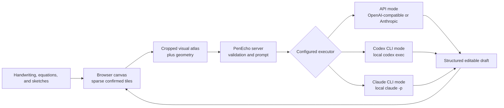

<h1 align="center">
  
</h1>

<p align="center"><strong>Think with AI beyond the chat box.</strong></p>

<p align="center">PenEcho is a shared canvas where handwriting, equations, diagrams, and spatial context become part of the conversation.</p>

<p align="center">
  
</p>

## Think on the canvas

Put a question, equation, diagram, or half-formed idea anywhere on the canvas and pause. PenEcho reads your marks and their spatial relationships, then answers beside them. You can work through a problem without translating every step into a chat message or rebuilding it with rigid diagram tools.

- Get answers, hints, explanations, continuations, formulas, plots, and diagrams directly on the canvas.
- Move, resize, accept, or discard every AI draft before it becomes part of your work.
- Draw naturally with a stylus or mouse, then pan and zoom across a sparse `20,000 x 20,000` canvas.
- Draw a freehand lasso around confirmed ink to move, resize, or recolor it locally; accepting or cancelling a selection never triggers an AI request.
- Choose Arcane, Sci-fi, or Research mode to match the kind of problem you are exploring.
- Save lightweight snapshots locally in your browser. Starting a new canvas can overwrite the current snapshot, save a new copy, or continue without saving; unconfirmed AI drafts are never included.

PenEcho has no npm runtime dependencies. It only allocates `512 x 512` tiles where ink exists, so the huge logical canvas does not become a huge bitmap.

## How it works



The browser sends only the relevant canvas crop and geometry. The server validates the request, uses the selected executor, and returns a movable draft that stays separate from confirmed ink until you accept it.

## Quick start

You need [Node.js 18.17+](https://nodejs.org/) and one of the following: an API key, an authenticated [Codex CLI](https://developers.openai.com/codex/cli), or an authenticated [Claude Code CLI](https://code.claude.com/docs/en/overview).

```bash
npm install -g penecho
```

### Option 1: OpenAI or Claude API

```bash
penecho doctor --api
penecho --api
```

The doctor first asks for the API format: `openai` (the default) or `anthropic`. It then guides you through the URL, model, reasoning effort, and hidden API-key prompt. Configuration is stored locally in `~/.penecho/config.env`; the key is plaintext, receives owner-only permissions on POSIX systems, and is never sent to browser code. Protect this file like any other local credential.

The same neutral fields work for both providers: `AI_API_FORMAT`, `AI_API_URL`, `AI_API_MODEL`, and `AI_API_KEY`. OpenAI-compatible local services also use `AI_API_FORMAT=openai`. Known `AI_EFFORT` values are `low`, `medium`, `high`, `xhigh`, and `max`; other strings are accepted and passed through for model-specific or future levels. API mode uses `max` when it is omitted. OpenAI-format requests use `reasoning_effort`, while Anthropic requests use `output_config.effort`. If a model rejects a value, PenEcho shows the upstream API or CLI diagnostic. A [Claude subscription and Claude API billing are separate](https://support.claude.com/en/articles/9876003-i-have-a-paid-claude-subscription-pro-max-team-or-enterprise-plans-why-do-i-have-to-pay-separately-to-use-the-claude-api-and-console), so choose Claude CLI mode below if you want to use your existing Claude Code login rather than an Anthropic API key.

### Option 2: Codex on your machine

```bash
# You are already signed in to Codex.
# codex login
penecho doctor --codex
penecho --codex
```

This runs `codex exec` locally for each canvas request. It uses your authenticated Codex CLI directly and does not require an API key. Startup checks the CLI version and login state without calling a model or consuming tokens. It is a local execution path through Codex, not a local model.

Set `CODEX_CLI_MODEL` to any model ID accepted by your installed Codex CLI. Leave it empty to keep your CLI's configured default. If `AI_EFFORT` is set, PenEcho passes it as the Codex `model_reasoning_effort` override; when empty, Codex keeps its own default.

`CODEX_CLI_TIMEOUT_SECONDS` defaults to 120 seconds per model attempt.

### Option 3: Claude on your machine

```bash
# Install Claude Code and sign in once if needed.
# claude auth login
penecho doctor --claude
penecho --claude
```

This runs `claude -p` locally for each canvas request, using the Claude Code login already available on the machine. It does not need `AI_API_URL` or `AI_API_KEY`. The startup check only verifies the CLI version and authentication state; it does not call a model.

Set `CLAUDE_CLI_MODEL` to an alias such as `sonnet`, `opus`, or `haiku`, or to a full model ID accepted by your installed Claude CLI. Leave it empty to keep your CLI's configured default. If `AI_EFFORT` is set, PenEcho passes `--effort` to Claude; when empty, Claude keeps its own default. See the [Claude Code CLI reference](https://code.claude.com/docs/en/cli-usage) for accepted model forms.

`CLAUDE_CLI_TIMEOUT_SECONDS` defaults to 120 seconds per model attempt.

Choose another port when needed:

```bash
penecho --codex --port 4000
```

### Run from this source directory

No separate build step is required. Copy one ready profile to `.env`, then run:

```bash
# API: replace AI_API_KEY after copying
cp .env.api .env

# Or use the Codex CLI already logged in on this machine
cp .env.codex .env

# Or use the Claude CLI already logged in on this machine
cp .env.claude .env
```

On Windows PowerShell, use `Copy-Item .env.api .env` (or the corresponding Codex/Claude filename).

```bash
npm install
npm start
```

Open [http://localhost:3888](http://localhost:3888). Other devices on the same trusted LAN can use `http://<this-computer-LAN-IP>:3888`.

## Token use and cost

The following is an illustrative estimate, not an enforced PenEcho token budget. Assuming a request uses `10,000` input tokens and `1,000` output tokens, the standard short-context API cost would be:

- `gpt-5.6-sol`: `10,000 x $5.00 / 1M + 1,000 x $30.00 / 1M = $0.080`
- `gpt-5.6-terra`: `10,000 x $2.50 / 1M + 1,000 x $15.00 / 1M = $0.040`
- `gpt-5.6-luna`: `10,000 x $1.00 / 1M + 1,000 x $6.00 / 1M = $0.016`

At those example quantities, that is about 1.6 to 8 cents per request. Actual input, reasoning, and output usage varies by canvas content, model, provider, and retry behavior. Prices can change, so check the [OpenAI API pricing](https://developers.openai.com/api/docs/pricing) page for current rates.

If you sign in to Codex with ChatGPT, PenEcho uses the Codex usage included with your plan instead of an API key. Included limits vary by plan, and additional usage may require ChatGPT credits. See [Codex pricing](https://learn.chatgpt.com/docs/pricing) for current plans and limits. Claude CLI mode similarly uses the account authenticated by Claude Code; it is distinct from Anthropic API billing.

## Help test more models

PenEcho supports model selection independently for API, Codex CLI, and Claude CLI execution. Model behavior still varies. If you find a model-specific issue, please open an issue with the executor, model name, a reproducible canvas example, expected and actual results, and a screenshot with secrets removed.

## Safe deployment

PenEcho listens on `0.0.0.0:3888` by default so localhost and trusted-LAN access work immediately. Choose the deployment boundary that matches your executor:

- **Codex CLI and Claude CLI modes:** use them only on the local machine or a trusted, directly connected LAN. A valid request starts a local CLI process, so do not expose either mode directly to the public internet or an untrusted reverse proxy. Both work immediately from localhost and LAN addresses without a public-origin setting. PenEcho checks the Host, client network, exact Origin, process-lifetime session cookie, and JSON content type before launching the selected CLI. Each valid new request immediately supersedes the prior request; it never waits in a queue or returns a busy response.
- **API mode:** local, LAN, proxy, and remote requests are intentionally accepted without PenEcho-level Host or Origin restrictions. If you expose it publicly, place it behind HTTPS, authentication, rate limiting, and request-size controls. Keep `.env` and provider keys private; credentials remain in the Node.js process and are never sent to browser code.

For either mode, keep debug artifacts and request tracing disabled in production unless you are actively diagnosing a problem, and never publish `.env`, logs, screenshots, or saved requests containing private content. `PENECHO_REQUEST_TRACE=true` stores each valid AI request under `logs/requests` (or the configured state directory), including the source `atlas.png`, the configured outbound WebP/JPEG artifact when encoding succeeds, MIME types and byte sizes, the outbound model request with credentials redacted, every raw and parsed model response, any PNG format fallback, and the final success, cancellation, timeout, or error state. `PENECHO_REQUEST_TRACE_LIMIT` controls retention and defaults to 100.

## Useful configuration

`.env.example` is the complete annotated reference. `.env.api`, `.env.codex`, and `.env.claude` are the short ready-to-copy profiles. These settings cover most custom setups:

| Setting | Purpose |
| --- | --- |
| `AI_PROVIDER` | Executor: `api`, `codex-cli`, or `claude-cli` |
| `AI_API_FORMAT` | API request format: `openai` (default example) or `anthropic` |
| `AI_API_URL` / `AI_API_KEY` | API endpoint and credential; used only in API mode |
| `AI_API_MODEL` | Model used in API mode |
| `AI_EFFORT` | Global reasoning effort; known values are `low`, `medium`, `high`, `xhigh`, and `max`, other strings pass through; API defaults to `max`, while an empty CLI value preserves the CLI default |
| `PENECHO_AI_IMAGE_FORMAT` | Image format sent to the model: `webp` (default), `png`, or `jpeg`; `jpg` is accepted as an alias |
| `CODEX_CLI_MODEL` | Optional model override for Codex CLI mode |
| `CLAUDE_CLI_MODEL` | Optional alias or model-ID override for Claude CLI mode |
| `AUTO_AI_DELAY_SECONDS` | Initial delay before automatic recognition; the browser control can override it from 0 to 10 seconds |
| `PENECHO_REQUEST_TRACE` | Save local per-request image, outbound request, response, and outcome traces; disabled by default |
| `PENECHO_REQUEST_TRACE_LIMIT` | Number of local request traces retained, default 100 and maximum 1000 |
| `HOST` / `PORT` | Server address and port, default `0.0.0.0:3888` |

Run the checks before submitting a change:

```bash
npm run check
```

For implementation details, see the [architecture notes](docs/architecture.md).

## Build it with us

PenEcho is still young, with real work left in recognition, visual tools, model support, and pen interaction. Open an issue, propose an idea, or send a pull request. If PenEcho clicks for you, star the repo, share the demo, and help us make it better.

Read [CONTRIBUTING.md](CONTRIBUTING.md) to get started.

## License and commercial use

PenEcho is open source under [GNU AGPL v3.0 only](LICENSE). Commercial use is allowed under the AGPL. If you modify PenEcho and provide that version to users over a network, you must offer those users the corresponding source code as required by the license.

An alternative [commercial license](COMMERCIAL-LICENSE.md) is available for proprietary products and hosted services that cannot meet the AGPL requirements. The PenEcho name and logo are governed separately by the [PenEcho trademark policy](TRADEMARKS.md).

Contributors keep ownership of their work and grant the project the rights needed to offer both AGPL and commercial editions. See the [contributor agreement](CONTRIBUTOR-LICENSE-AGREEMENT.md).
